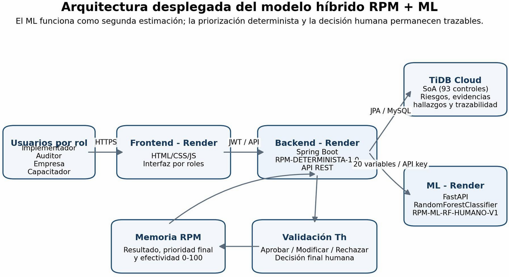
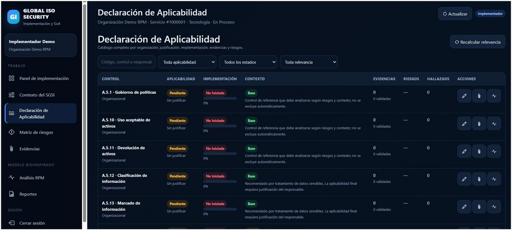
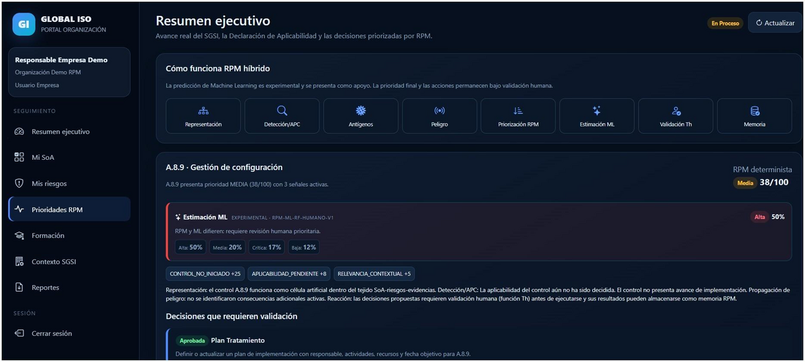

# Global ISO Security

Plataforma web para apoyar la gestión de seguridad de la información basada en ISO/IEC 27001: catálogo de controles, Statement of Applicability (SoA), riesgos, evidencias, auditoría, formación y un módulo RPM híbrido determinista + Machine Learning.

   

> A multi-company security-management prototype connecting controls, risks, evidence and human review in one workflow.

## Evidence preview

These screenshots are extracted directly from the project thesis and show the deployed application using synthetic demo data.

## What it demonstrates

- **93** ISO/IEC 27001:2022 reference controls and service-level SoA.
- Risk registration, risk–control relationships and follow-up.
- Evidence upload/download, SHA-256 hashing, validity and verification.
- Audit findings, recurrence and closure.
- Deterministic, explainable RPM with priority, response, validation and memory.
- Training, assessments, verifiable certificates and executive reporting.
- JWT authentication, BCrypt hashing, role authorization and company isolation.

También incluye readiness/liveness separados y portales diferenciados por rol.

## Architecture

~~~mermaid
flowchart TB
 A[Users by role] --> B[Frontend on Render]
 B --> C[Spring Boot backend on Render]
 C --> D[TiDB Cloud via MySQL protocol]
 C --> E[FastAPI ML service on Render]
 C --> F[Deterministic RPM and human validation]
 F --> G[RPM memory]
~~~

La solución desplegada se compone de:

- **Frontend:** aplicación web servida mediante Nginx.
- **Backend:** API Spring Boot con Spring Security, JPA/Hibernate y conexión MySQL-compatible.
- **Base de datos:** TiDB Cloud mediante el protocolo MySQL.
- **ML Service:** microservicio FastAPI/Python con Random Forest.
- **Render:** hosting del backend, frontend y ML service.
- **GitHub:** código fuente, revisiones y Security CI.

Referencias visuales: [arquitectura](docs/images/global-iso-architecture.png), [RPM + ML](docs/images/global-iso-rpm-ml-preview.png) y [SoA](docs/images/global-iso-soa-preview.png).

## Roles

| Role | Responsibility |
|---|---|
| ADMINISTRADOR | Companies, users, services, catalog, roles and reports |
| IMPLEMENTADOR | Context, SoA, risks, evidence and RPM analysis |
| AUDITOR | Evidence validation, findings, signatures and RPM decisions |
| CAPACITADOR | Training, assessments, certificates and formative actions |
| USUARIO_EMPRESA | Executive portal, progress, risks, training and reports |

See the complete [permission matrix](docs/MATRIZ_ROLES_PERMISOS.md).

## Verified experimental results

| Evaluation | Verified result | Interpretation |
|---|---:|---|
| Initial deterministic RPM pilot | 120 synthetic scenarios · 94.2% agreement (113/120) | Agreement with designed synthetic labels |
| RPM V2 cohort | 500 scenarios · 20 synthetic organizations · 5 sectors · 92 controls · 96.8% agreement (484/500) | Consistency with experimental design, not expert truth |
| Blind human validation | 80 cases · 50% exact agreement · macro F1 0.493 · Cohen's kappa 0.333 | One formal sample with one evaluator |
| Logistic Regression | 62.5% accuracy · 61.2% macro F1 · kappa 0.491 | ML comparison |
| Random Forest | 72.5% accuracy · 68.3% macro F1 · kappa 0.605 | Selected for experimental deployment |
| Extra Trees | 71.25% accuracy · 68.85% macro F1 · kappa 0.591 | Highest macro F1 in comparison |

The deployed experimental model is RPM-ML-RF-HUMANO-V1. The deterministic RPM is not trained: it uses explicit signals, weights and thresholds. The ML component is trained on pre-decision variables and estimates LOW, MEDIUM, HIGH or CRITICAL priority. Human validation remains mandatory when RPM and ML disagree.

RPM está deliberadamente acotado: no es una IA general de ciberseguridad ni intenta aprender automáticamente en producción. Apoya decisiones sobre priorización de controles, señales de contexto, características organizacionales, riesgos e implementación ISO/IEC 27001. Las reglas deterministas y la validación humana siguen siendo parte del proceso.

El servicio ML es independiente, se entrena con escenarios controlados y complementa el RPM determinista. No reemplaza las reglas, los controles ni la revisión humana.

## Stack and evidence map

Java 20 · Spring Boot 3.2 · Spring Security · JWT · JPA/Hibernate · MySQL · HTML5 · CSS3 · JavaScript · Docker Compose · Nginx.

| Area | Current scope |
|---|---|
| Compliance | 93-control catalog, SoA and applicability rationale |
| Risk and audit | Risks, findings, recurrence and closure |
| Evidence | Persistent files, SHA-256 and verification |
| RPM | Detection, response, coordination, evaluation and memory |
| Reporting | PDF and Excel outputs |

## Run locally

~~~bash
cp .env.example .env
# Set local passwords and a strong JWT_SECRET; never commit .env.
docker compose up --build
~~~

Open http://localhost:8080/pages/login.html. Demo seed data is controlled by environment variables; never publish passwords in documentation or commit .env.

Useful documentation: [README_DOCKER.md](README_DOCKER.md), [README_RENDER.md](README_RENDER.md), [docs/ARQUITECTURA_RPM.md](docs/ARQUITECTURA_RPM.md), [docs/GUIA_PRUEBAS.md](docs/GUIA_PRUEBAS.md), [ENTREGA_RPM.md](ENTREGA_RPM.md), [IMPLEMENTACION_RPM_INTEGRAL.md](IMPLEMENTACION_RPM_INTEGRAL.md).

## Estado validado de producción

Durante la estabilización se auditó la base productiva con 5 roles requeridos, 7 sectores, 93 controles activos, 93 códigos únicos, 35 servicios y 3.255 relaciones SoA (93 por servicio), sin combinaciones faltantes ni duplicados servicio/control. La restricción `UNIQUE(servicio_id, control_id)` protege la unicidad. Estos valores son una fotografía de la auditoría y pueden cambiar con el uso futuro.

En producción se mantiene `SEED_ENABLED=false` y `SEED_DEMO_DATA=false`. `DataInitializer` continúa disponible para bootstrap controlado, desarrollo, CI y recuperación, pero no participa en cada startup productivo. Un servicio nuevo inicializa su SoA mediante `ServicioService.crearServicio()` → `SoaService.inicializar()`; `SoaService.listar()` también puede completar controles faltantes.

`/health` y `/api/health` representan liveness. `/readiness` y `/api/readiness` representan readiness: la aplicación debe haber completado su ciclo de arranque antes de aceptar tráfico.

## Cuentas de demostración

- `implementador@demo.com` → IMPLEMENTADOR
- `auditor@demo.com` → AUDITOR
- `capacitador@demo.com` → CAPACITADOR
- `empresa@demo.com` → USUARIO_EMPRESA

La contraseña de demostración se gestiona fuera del repositorio. No se publican contraseñas, hashes ni secretos.

## Limitations

This is an academic and demonstration system. Production use would require threat modeling, deployment hardening, managed secrets, security testing, backup/recovery and formal compliance review.

## Academic reference

**Thesis:** Priorización bioinspirada de riesgos SoA ISO/IEC 27001 para organizaciones mediante RPM híbrido con aprendizaje automático, Bogotá 2026. The thesis is the primary source for the experimental results and visual evidence summarized here. The full PDF is not copied because publication authorization is not established.

## Related case study

[Read the technical case study](https://andres-obando-portfolio-static.onrender.com/case-studies/global-iso-security/)

## Author

**Andrés Obando** · [GitHub](https://github.com/cito515432) · [LinkedIn](https://www.linkedin.com/in/andres-obando-08095b203) · [Portfolio](https://andres-obando-portfolio-static.onrender.com/)
